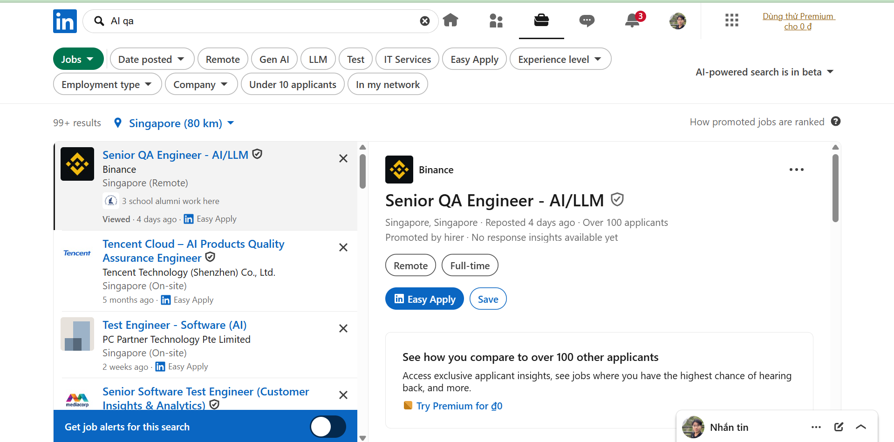
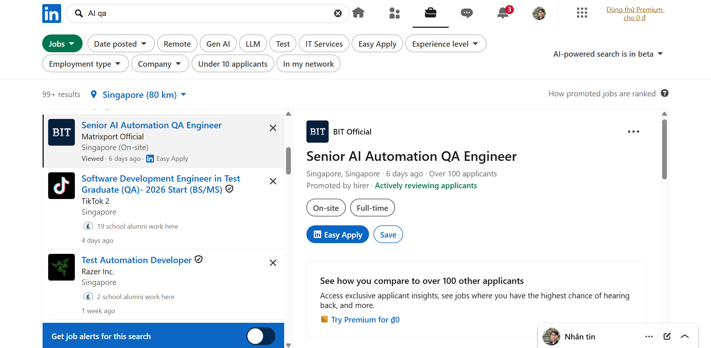
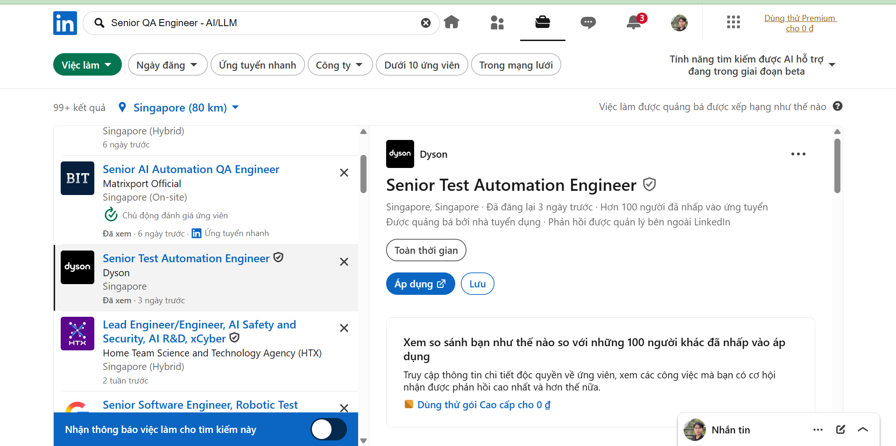
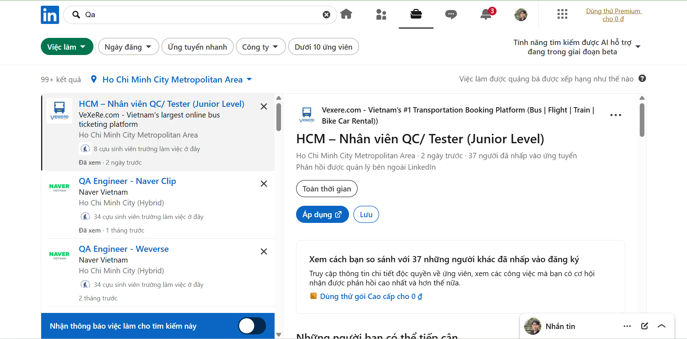
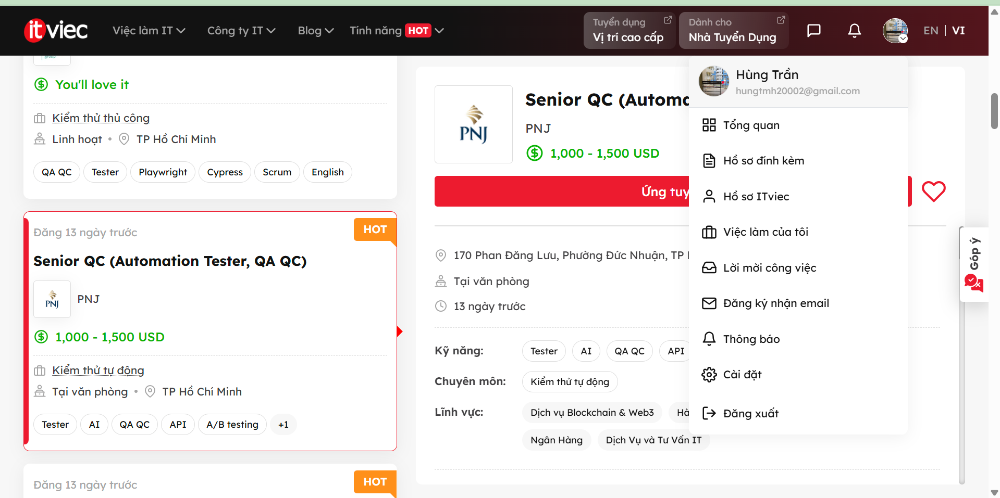
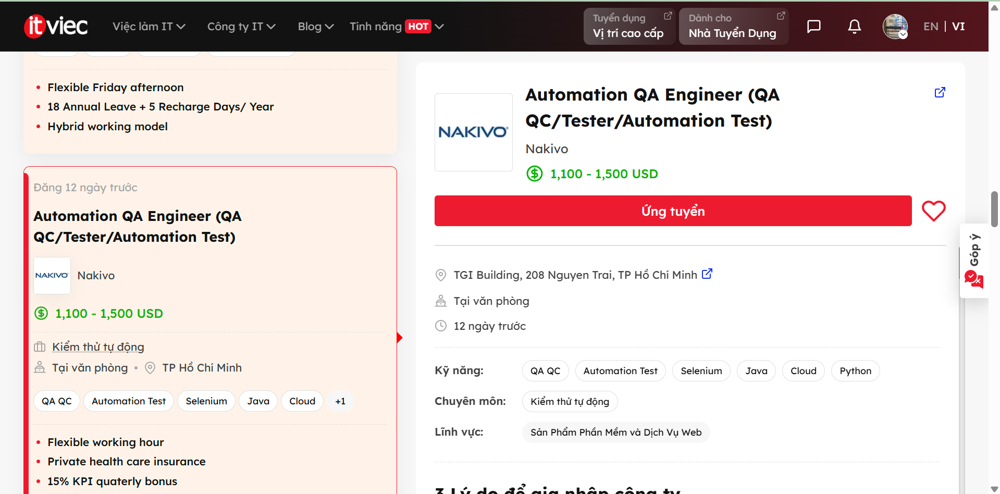
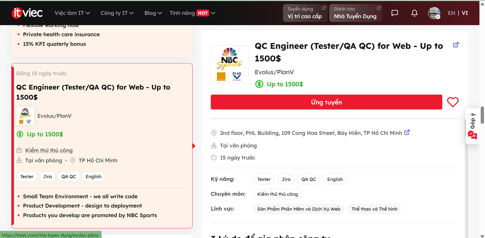
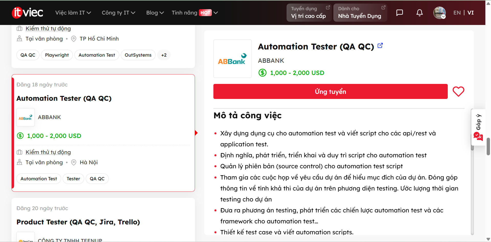
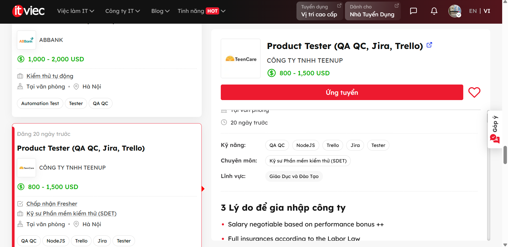
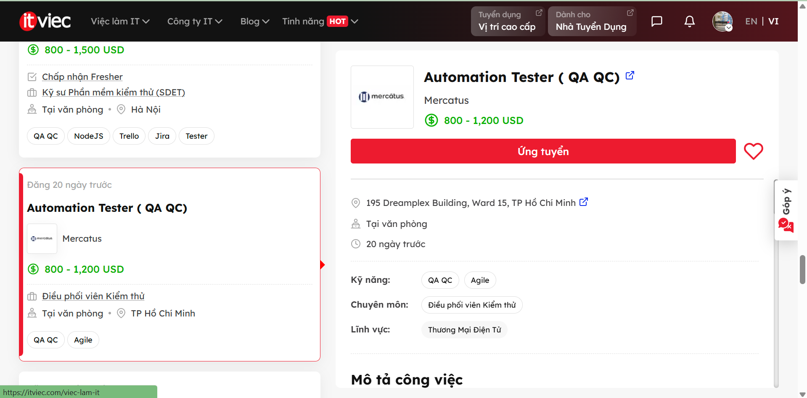

# Requirement 1 - QA/QC Job Market 2026+

**Objective:** Find 10 QA/QC job postings published within 60 days of the submission date. At least 3 positions must require AI/LLM/automation-AI skills.
> **Note on Anti-cheat:** All screenshots must show your account name (login name / display name) on the job platform in the corner.

---

## Job Posting 1 (Requires AI/LLM/Automation-AI skills)
* **Link:** https://www.linkedin.com/jobs/search-results/?currentJobId=4299341298&eBP=NON_CHARGEABLE_CHANNEL&refId=usZiZPho7%2BcaZzruYVMfSw%3D%3D&trackingId=MtoGlJXobQjiRia0gtrWiQ%3D%3D&keywords=AI%20qa&origin=SEMANTIC_SEARCH_LANDING_PAGE
* **Dated Screenshot:**  *(Ensure account name and date are visible)*
* **Job Description:** 
  * AI / LLM application quality assurance
  * Design and execute end-to-end testing strategies for LLM-based consumer products (functionality, data, model behavior)
  * Verify the correctness, consistency, stability, and safety of LLM outputs
  * Regression testing and risk assessment for model updates / prompt iterations / data changes
  * Design and develop automated testing and QA tools to improve testing efficiency and coverage
  * Use or introduce AI technologies (such as LLM) to enhance test design, defect analysis, and test case generation capabilities
* **Required Skills:**
  * Bachelor or Master in computer science, computer engineering or related area
  * At least 3+ years of software QA engineering experiences
  * Full cycle testing with test planning and both manual/automation execution
  * Solid Java coding skills, and experienced in automation or QA tools development
  * Good understanding in AI applications and LLM prompt engineering techniques
  * Experiences in LLM development or eval is a plus
* **Salary:** Not disclosed
* **AI Impact Analysis:** This role revolves around AI, shifting QA engineers from traditional deterministic testing to evaluating LLM model outputs. QA must possess deep knowledge of prompt engineering and create automated tools for AI applications to analyze defects.

---

## Job Posting 2 (Requires AI/LLM/Automation-AI skills)
* **Link:** https://www.linkedin.com/jobs/search-results/?currentJobId=4418544694&eBP=NON_CHARGEABLE_CHANNEL&refId=usZiZPho7%2BcaZzruYVMfSw%3D%3D&trackingId=4LFJOzC11osY8hl%2FWu1GZA%3D%3D&keywords=AI%20qa&origin=SEMANTIC_SEARCH_LANDING_PAGE
* **Dated Screenshot:**  *(Ensure account name and date are visible)*
* **Job Description:** 
  * Lead the top-level design and continuous evolution of the automated testing framework
  * Leverage AI-powered testing tools extensively to significantly improve test generation, execution, and analysis
  * Drive standardization and implementation of AI-assisted testing workflows across the team
  * Lead development of functional, performance, stability scenarios, and chaos engineering
  * Collaborate with engineering teams to shift QA practices earlier into development lifecycle
* **Required Skills:**
  * Proven experience in test development or automation testing
  * Strong proficiency in Python and/or Java, and leading development of testing platforms
  * Deep understanding of API automation, CI/CD integration, and mainstream testing frameworks
  * Practical experience with AI testing tools or AI-assisted QA workflows
* **Salary:** Not disclosed
* **AI Impact Analysis:** Integrating AI into the CI/CD workflow automates test generation and defect analysis instead of maintaining manual scripts. This role requires using AI to accelerate the testing process for large-scale distributed systems.

---

## Job Posting 3 (Requires AI/LLM/Automation-AI skills)
* **Link:** https://www.linkedin.com/jobs/search-results/?currentJobId=4403158871&eBP=NON_CHARGEABLE_CHANNEL&refId=Kt7LD%2FQ%2BnRRYE55DrRF%2F%2Bg%3D%3D&trackingId=kDJnUkTzT6PQCPOoSiS0qw%3D%3D&keywords=Senior%20QA%20Engineer%20-%20AI%2FLLM&origin=SEMANTIC_SEARCH_LANDING_PAGE
* **Dated Screenshot:**  *(Ensure account name and date are visible)*
* **Job Description:** 
  * Design, develop and maintain automated test solutions, frameworks, and tools
  * Develop software and hardware simulators for testing
  * Create and improve AI-powered test tools
  * Write reliable, maintainable code for automation and tool development
  * Design, build, and manage databases for tool and app data
* **Required Skills:**
  * Python: Advanced scripting and software development for automation and AI
  * Simulator development: Experience creating and maintaining software/hardware simulators
  * Web Development: HTML, CSS, JavaScript, Flask, FastAPI, Vue
  * Database: SQL or NoSQL databases
  * AI Engineering: Experience with large language models (LLMs), prompt engineering, RAG, and Agentic AI
* **Salary:** Not disclosed
* **AI Impact Analysis:** Along with testing, AI is present in sophisticated simulation tools (Agentic AI, RAG) created by the engineer to simulate test scenarios that traditional automation cannot handle.

---

## Job Posting 4
* **Link:** https://www.linkedin.com/jobs/search-results/?currentJobId=4421374293&eBP=NON_CHARGEABLE_CHANNEL&refId=cw8azqyQyRUU5lYzU4ubzQ%3D%3D&trackingId=nFLt4772M1C%2B5%2F6uQ2aBCg%3D%3D&keywords=Qa&origin=BLENDED_SEARCH_RESULT_NAVIGATION_SEE_ALL&originToLandingJobPostings=4421374293%2C4405746180%2C4385248485
* **Dated Screenshot:**  *(Ensure account name and date are visible)*
* **Job Description:** 
  * Analyze and review requirements, plan testing for platform features and system integration
  * Write test cases/test designs, create test cycles, and manage them on the system
  * Conduct API testing, workflow, automated jobs, and background processes
  * Write automation scripts using Cypress, Playwright to accelerate the testing process
* **Required Skills:**
  * 1-3 years of experience and holds a testing certification (ISTQB, QA Foundation)
  * Writes clear, systematic test cases and test plans, with good logical thinking
  * Familiar with automation testing tools (Cypress, Selenium, Playwright, etc.)
  * Communicates well with PO and Dev, proactively asks questions and provides feedback
* **Salary:** Not disclosed
* **AI Impact Analysis:** Although focused on traditional automation (Cypress, Playwright), applying AI (like Copilot/ChatGPT) provides significant benefits such as quickly generating boilerplate code and reducing test design time compared to before.

---

## Job Posting 5 (Requires AI/LLM/Automation-AI skills)
* **Link:** https://itviec.com/viec-lam-it/qa-qc?job_selected=senior-qc-automation-tester-qa-qc-pnj-5542
* **Dated Screenshot:**  *(Ensure account name and date are visible)*
* **Job Description:** 
  * Plan testing for traditional and AI-integrated products
  * Execute functional, UI/UX, and AI behavior testing; check edge cases and misuse scenarios
  * Verify the accuracy, reliability, and fairness of AI results
  * Apply AI testing tools (LLM evaluation, synthetic data)
  * Check the completeness and accuracy of AI training data
* **Required Skills:**
  * At least 4 years of experience in Software Testing Automation applying AI in testing
  * Ability to analyze system risks and handle multiple projects simultaneously
  * End-user mindset, careful; ISTQB, Agile certifications are a plus
* **Salary:** 1,000 - 1,500 USD
* **AI Impact Analysis:** The job requires not only using AI tools but also directly validating training data, machine learning models, and AI fairness, marking a major shift from traditional software testing to Model Testing.

---

## Job Posting 6 (Requires AI/LLM/Automation-AI skills)
* **Link:** https://itviec.com/viec-lam-it/qa-qc?job_selected=automation-qa-engineer-qa-qc-tester-automation-test-nakivo-0115
* **Dated Screenshot:**  *(Ensure account name and date are visible)*
* **Job Description:** 
  * Design, develop, and execute automated test scripts using industry-standard tools
  * Contribute to the continuous improvement of the automation testing process
  * Design, create, and manage automation test cases using AI technologies
  * Identify, report defects, and analyze test results cross-functionally
* **Required Skills:**
  * 3 years of experience or more in relevant positions
  * Proficient in Java, Python, or C# and familiar with Selenium/Appium
  * Experience with AI-automation testing (e.g., Copilot, Cursor, Perplexity)
* **Salary:** 1,100 - 1,500 USD
* **AI Impact Analysis:** Requires proficient use of AI coding assistants (Copilot, Cursor) in writing Test Automation algorithms to accelerate design and debug testing systems much faster than manual approaches.

---

## Job Posting 7
* **Link:** https://itviec.com/viec-lam-it/qa-qc?job_selected=qc-engineer-tester-qa-qc-for-web-up-to-1500-evolus-planv-5225
* **Dated Screenshot:**  *(Ensure account name and date are visible)*
* **Job Description:** 
  * Participate in development of server and client applications for sports team management
  * Work closely with technical teams to develop enterprise applications
  * Analyze requirements, develop and execute test cases and test scripts
  * Manually test enterprise web-based systems
* **Required Skills:**
  * Minimum 2 years of experience in manual testing for enterprise web-based systems
  * Working with Issue Tracking Systems, such as JIRA is required
  * Strong English reading and writing skills
  * Performance, security, or cross-browser testing is a plus
* **Salary:** Up to 1500 USD
* **AI Impact Analysis:** For Manual QC working on distributed Web systems, using AI helps to quickly simulate architectural diagrams to discover practical edge cases, while also writing clear and logical bug reports in English.

---

## Job Posting 8
* **Link:** https://itviec.com/viec-lam-it/qa-qc?job_selected=automation-tester-qa-qc-abbank-0039
* **Dated Screenshot:**  *(Ensure account name and date are visible)*
* **Job Description:** 
  * Define, develop, and maintain scripts for automation tests (API/REST/Application)
  * Design test cases and write automation scripts in collaboration with the Manual testing team
  * Provide testing solutions and automation test framework strategies
  * Manage source control for automation test scripts
* **Required Skills:**
  * Over 2 years of experience in automation testing for API/REST, Mobile, or Web
  * Proficient in writing automation test scripts with Java, C#.net, Python, JS, etc.
  * Experience using Katalon, Postman, Rest Assured, Selenium, Jmeter, CI/CD
* **Salary:** 1,000 - 2,000 USD
* **AI Impact Analysis:** Applying AI to API testing allows QC to simply provide JSON/Swagger formats; AI will automatically generate dozens of payload variants and scan for security vulnerabilities directly in the CI/CD pipeline.

---

## Job Posting 9
* **Link:** https://itviec.com/viec-lam-it/qa-qc?job_selected=product-tester-qa-qc-jira-trello-cong-ty-tnhh-teenup-1256
* **Dated Screenshot:**  *(Ensure account name and date are visible)*
* **Job Description:** 
  * Build reliable test cases covering core user flows
  * Detect and report critical issues before they impact users in product features
  * Work closely with Product Managers, Designers, and Engineers to validate new releases
  * Own testing processes for multiple product features and releases
* **Required Skills:**
  * 1-2 years of experience in software testing or QA roles
  * Familiarity with web/mobile application testing
  * Basic understanding of APIs, databases, and product workflows
  * Curious, proactive, user-focused mindset to find edge cases
* **Salary:** 800 - 1,500 USD
* **AI Impact Analysis:** In the Product Tester role, using AI serves as a large-scale sentiment feedback analysis tool, accurately suggesting which UI/UX flows should be prioritized for testing based on real-world data insights.

---

## Job Posting 10
* **Link:** https://itviec.com/viec-lam-it/qa-qc?job_selected=automation-tester-qa-qc-mercatus-4125
* **Dated Screenshot:**  *(Ensure account name and date are visible)*
* **Job Description:** 
  * Design and write test automation scripts using test automation frameworks
  * Run tests, optimize automation scripts, and collaborate with developers
  * Handle manual test plans and test cases if required
  * Stay up to date on emerging automation technologies
* **Required Skills:**
  * Minimum 2+ years of experience in automation testing
  * Experience with Postman, Cypress, Selenium
  * Proficiency in languages like C, C++, C#, Java, JavaScript, Python
  * Good English and understanding of testing life cycle (Agile/Scrum)
* **Salary:** 800 - 1,200 USD
* **AI Impact Analysis:** AI performs test automation code maintenance, especially with self-healing capabilities. When UI changes cause locator errors in scripts, AI automatically recognizes UI elements and updates them without waiting for manual fixes.
